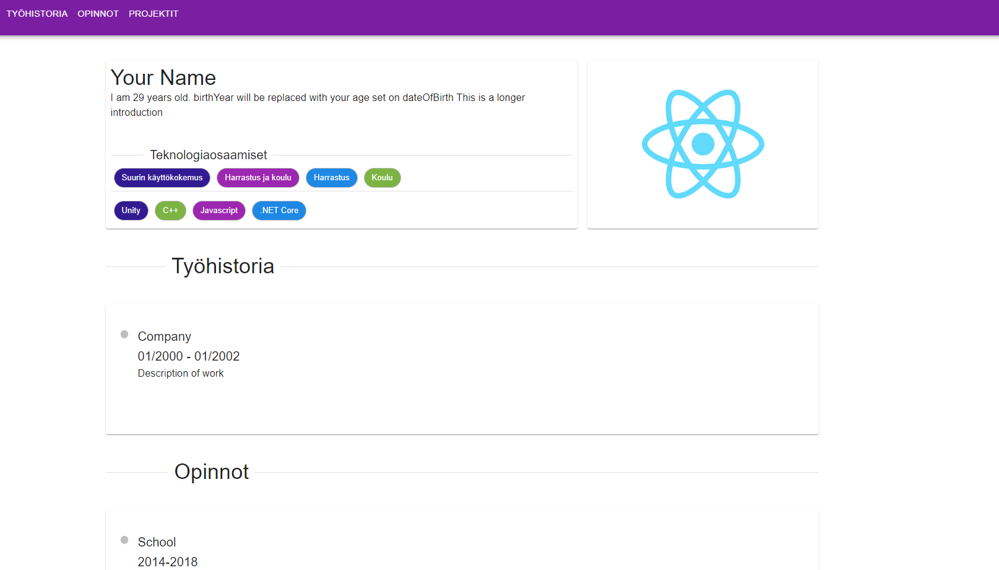

# LazyDevPortfolio
React porfolio page with easy JSON configuration
This project uses JSON to generate simple portfolio

 

 ## Features
 * Introduction with automatic age update
 * Your known technologies with labels (hobby, school etc)
 * Job and study history timelines
 * Project view with possible youtube video and github README.md file output

 ## Install
 1. Clone project
 2. Run npm install
 3. Run npm start
 4. Use JsonCVData/Templates as data, copy each file to JsonCVData and remove "_template" 

 ## TODO
 * Localizations as JSON too

